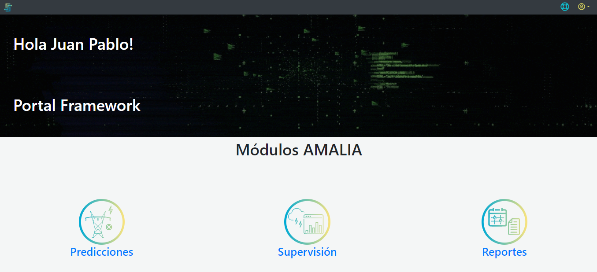

# AMALIA – Plataforma PowerFrames *Manual de usuario*

## Introducción
La plataforma de PowerFrames es una herramienta que tiene como propósito supervisión, pronostico y monitoreo de las descargas atmosféricas y la vulnerabilidad de los activos del pertenecientes al sistema eléctrico nacional.

La plataforma está basada en un sistema llamado AMALIA

## 1. [Entrada al aplicativo](./docs/Ingreso.md)

Este servicio es una aplicación web que es recomendada para ser usada en navegadores basados en **Chromium** como [Google Chrome](https://www.google.com/intl/es_es/chrome/), [EDGE](https://www.microsoft.com/es-es/edge), [BRAVE](https://brave.com/es/), [OPERA](https://www.opera.com/es) y  [SRWare Iron](https://www.srware.net/iron/), entre otros. 
Para acceder al aplicativo se debe ingresar a la URL [www.powerframes.co](http://www.powerframes.co/) y seguir las instrucciones que se muestra [aquí](./docs/Ingreso.md)

## 2. [Portal AMALIA](./docs/AMALIA/)

Ya dentro del aplicativo, AMALIA se encarga de dar la Bienvenida al usuario autenticado y mostrar los diferentes módulos dispuestos para ser usados, Predicciones, Supervisión y Reportes como se muestra en la [Bienvenida](./pictures/Imagen3.png). Acá el usuario debe elegir cuál de los módulos va a consultar e ingresar a él.

**Figura 3.** *Bienvenida*

### 2.1 [Módulo de reportes](../Plataforma_PowerFrames/docs/AMALIA/Reportes/Reportes.md)

En esta opción el usuario puede consultar la correlación que existe entre la salida de una línea de transmisión y una descarga atmosferíca, con el fin de determinar la posibilidad de que la causa de la falla (salida de línea) sea consecuencia de un rayo. 

La plataforma está configurado por defecto para todos los campos estén en blanco y sea el usuario el que ingrese la información necesaria para la consultacomo se muestra en el [Módulo de Reportes](../Plataforma_PowerFrames/pictures/Imagen7.png).

> *IMPORTANTE:* Para evitar errores con la estampa de tiempo de los eventos, se recomienda utilizar la hora del computador en horario militar (Formato 24 horas)

La forma en que se hace la solicitud del reporte está explicada [aquí](../Plataforma_PowerFrames/docs/AMALIA/Reportes/Reportes.md).

La información brindada en el soporte se explica en este [apartado](../Plataforma_PowerFrames/docs/AMALIA/Reportes/Reporte.md)
### 2.2. [Módulo de supervisión](./docs/AMALIA/Supervision/)
En este módulo AMALIA se encarga de brindarle al usuario en diferentes visualizaciones la información de recuento de rayos, densidad dinámica de rayos, probabilidades de falla, descargas atmosféricas, análisis de descargas, clusterización de las tormentas, ubicación de las torres, subestaciones y los trazados para rangos de tiempo y espacio definidos por el usuario.
La plataforma está configurado por defecto para que el usuario visualice el mapa de colombia con la información de **"Tiempo Real"**, el mapa se va a mostrar centrad y sin ningún filtro temporal, ni espacial como se muestra en [Figura7](./pictures/Imagen7.png).

En este módulo va a poder hacer uso de los siguientes layers (capas) dispuestas en el [panel derecho](../Plataforma_PowerFrames/pictures/Imagen19.png):

")

**Figura 8.** *Capas de herramientas (Layers)*

1. [**Herramientas generales**](./docs/AMALIA/Supervision/01_Herramientas.md)
2. [**Reanálisis de descargas**](./docs/AMALIA/Supervision/Reanalisis.md)
3. [**Descargas atmosféricas**](./docs/AMALIA/Supervision/Descargas.md)
4. [**Cluster de descargas**](./docs/AMALIA/Supervision/Clusters.md)
5. [**Torres**](./docs/AMALIA/Supervision/Torres.md)
6. [**Subestaciones**](./docs/AMALIA/Supervision/Subestaciones.md)
7. [**Trazado de líneas**](./docs/AMALIA/Supervision/trazados.md)
8. [**Actividad en líneas**](./docs/AMALIA/Supervision/Actividad.md)

>*IMPORTANTE*: El tiempo real está definido como el tiempo relativo correspodiente a 60 minutos, es decir, muestra la información de 60 minutos antes hasta el tiempo presente.

>*IMPORTANTE:* Las capas pueden no ser visibles por 2 razones
>1. El zoom no tenga el ajuste necesario para la capa, ya sea porque esté muy cerca o muy lejos y será necesario modificar el zoom para ver la capa, cuando esto ocurre se ve el siguiente [símbolo](./pictures/Imagen12.png) 
>2. Se haya apagado la visualización y en ese caso se verá el [símbolo](./pictures/Imagen11.png) 

### 2.3. [Módulo de predicción](./docs/AMALIA/Predicciones/)
En este módulo AMALIA se encarga de brindarle al usuario los modelos de prediciones tanto de [**Riesgo por descarga atmosférica**](./docs/AMALIA/Predicciones/Descarga.md) y [**Riesgo por movimientos en masa**](./docs/AMALIA/Predicciones/Masa.md) en donde se puede encontrar información sobre posibilidades de falla en horizontes de tiempo futuros. En la [Figura 15](../Plataforma_PowerFrames/pictures/Imagen15.png) el usuario debe elegir cuál opción va a consultar.

**Figura 15.** *Bienvenido a las Predicciones*
