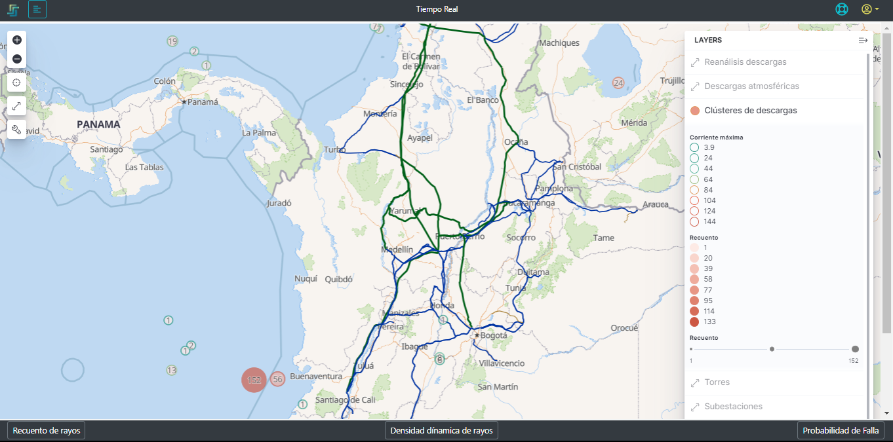
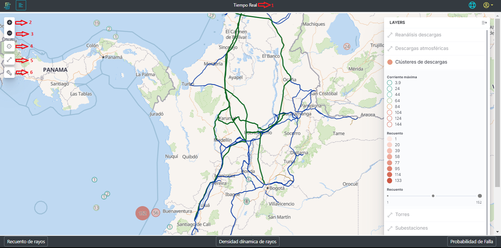
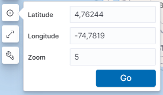
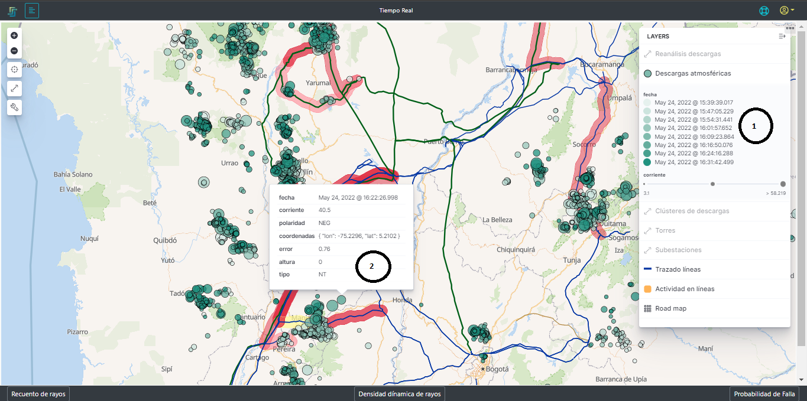

# AMALIA – Plataforma PowerFrames *Manual de usuario*

## Introducción
La plataforma de PowerFrames es una herramienta que tiene como propósito supervisión, pronostico y monitoreo de las descargas atmosféricas y la vulnerabilidad de los activos del pertenecientes al sistema eléctrico nacional.

La plataforma está basada en un sistema llamado AMALIA

## 1. Entrada al aplicativo
[dlkfkf](./docs/Ingreso.md) se relaciona todo lo corresponsiente a :
## 2.1. Portal de entrada
### 2.1.1. Botones disponibles
## 2.1.2 Acceso

## 2.2. Portal AMALIA  

Ya dentro del aplicativo, AMALIA se encarga de dar la Bienvenida al usuario autenticado y mostrar los diferentes módulos dispuestos para ser usados, Predicciones, Supervisión y Reportes como se muestra en la [Figura3](./pictures/Imagen3.png)

**Figura 3.** *Bienvenida*

### 2.2.2. Módulo de supervisión 
En este módulo AMALIA se encarga de brindarle al usuario en diferentes visualizaciones la información de recuento de rayos, densidad dinámica de rayos, probabilidades de falla, descargas atmosféricas, análisis de descargas, clusterización de las tormentas, ubicación de las torres, subestaciones y los trazados para rangos de tiempo y espacio definidos por el usuario.
La plataforma está configurado por defecto para que el usuario visualice el mapa de colombia con la información de **"Tiempo Real"**, el mapa se va a mostrar centrad y sin ningún filtro temporal, ni espacial como se muestra en [Figura7](./pictures/Imagen7.png).

**Figura 7.** *Vista inicia módulo de supervisión*

*IMPORTANTE*: El tiempo real está definido como el tiempo relativo correspodiente a 60 minutos, es decir, muestra la información de 60 minutos antes hasta el tiempo presente.

#### 2.2.2.1. Herramientas disponibles
La vista principal del módulo de supervisión cuenta con algunas herramientas dispuestas como botones que le permiten al usuario modificar algunos parametro y hacer uso de ellas para los propósitos específicos. 
En la [Figura 8](./pictures/Imagen8.png) se resaltan los 6 botones herramientas que tiene esta visualización, a continuación se explican cada uno de ellos.

**Figura 8.** *Herramientas de Usuario*

##### *1. Ventana de tiempo*:
Por defecto la plataforma establece la visualización del módulo de supervisión en tiempo real, no obstante, este label le muestra al usuario la ventana de tiempo que tiene seleccionada y sobre la cual se está mostrando toda la información del módulo, de tal forma que cuando se usa algún filtro temporal, este label muestre la ventana consultada.

##### *2. Acercar*:
Esta herramienta le permite al usuario acercar la vizualización, teniendo en cuenta que el acercamiento se va a realizar con base en la el punto medio de la pantalla cada que se haga click sobre él.

##### *3. Alejar*:
Esta herramienta le permite al usuario alejar la vizualización, teniendo en cuenta que el alejamiento se va a realizar con base en la el punto medio de la pantalla cada que se haga click sobre él.

##### *4. Ir a*:
Este botón le permite al usuario ingresar la longitud y latitud, además del zoom como se muestra en la [Figura 9](./pictures/Imagen9.png). de un punto específico y con determinado zoom para que la plataforma centre ese punto en la mitad de la pantalla con el zoom especificado.

**Figura 9.** *Ir a*

*IMPORTANTE*: El valor del zoom debe estar entre 5 y 24, para valores fuera de ese rango la plataforma va a solicitar un nueva valor que cumpla estas condiciones.

##### *5. Ajuste a los datos*:
Con el uso de esta herramienta la plataforma centra el mapa de Colombia con el máximo alejamiento, mostrando todos los datos que se tienen para la ventana de tiempo seleccionada.

##### *6. Herramientas de selección*:
[Figura 10](./pictures/Imagen11.png)

**Figura 10.** *Herramientas de selección*

#### 2.2.2.2. Reanálisis de desarcagas
Esta función de la plataforma se encarga de relacionar todas las descargas atmosféricas que se han detectado y almacenado con los activos que se tienen monitoreados, de tal forma que cada una de la descarga tenga información con base en los diferentes activos y de pueda ver la influencia que cada una de las descargas tiene con los elementos monitoreados, en la [Figura 10](./pictures/Imagen10.png)

Como esta información contiene la información de las descargas respecto a los activos, para esta capa contenga información visible, es necesario tener un acercamiento suficiente para que se vean las descargas discriminadas, los trazados y las torres de cada una de las líneas tal como se ve en la [Figura 10](./pictures/Imagen10.png). 

**Figura 11.** *Reanálisis de descargas*

#####  *1. Distancia*:
Tabla de convención dinámica de acuerdo a las descargas que hay en la ventana de tiempo consultada en todo el territorio. Estos valores varían con respecto a la mayor y menor distacia de las descargas a los activos, de tal forma que los círculos que representan las descargas van a tomar esos colores.

#### *2. Información de la descarga*:
En la capa del reanálisis de las descargas, cada una tiene un número que la representa, este número es la distancia radia en kilómetros al activo más cercano. Cuando se hace click sobre la descarga o se para sobre ella, esta despliega la información de la misma. En esta información se encuentra:

##### **Fecha:** 
La estampa de tiempo en la que la descarga se presentó.
##### **Distancia:** 
Este valor es el mismo que tiene la descaga y es la distancia en kilómetros al activo (torre) más cercana.
##### **Torre:** 
Hace referencia al activo más cercano relacionado con la descarga y muestra el nombre con la no####menclatura de cliente.
##### **Distancia_a:** 
es la distancia en kilómetros a la subestación A de la línea de transmisión
##### **Distancia_b:** 
es la distancia en kilómetros a la subestación B de la línea de transmisión
##### **Corriente:** 
Es la magnitud de la corriente de Kiloamperios de la descarga.
##### **Polaridad:** 
Hace raferencia a la polaridad de la descarga. Neg para descargas negativas y POS para descargas positivas.
##### **Coordenadas:** 
son los valores de longitud y latitud que determinan la posición estimada de la caída del rayo
##### **Error:** 
es el valor en kilómetros del error en la ubicación de la descarga, es decir, la descarga pudo haber caido dentro de una circunferencia con radio del valor del error en kilómetros.

#### 2.2.2.3. Descargas atmosféricas
Esta función de la plataforma se encarga de mostrar todas las descargas atmosféricas que se han detectado y almacenado con la información básica de la descarga, así se puede ver en en la [Figura 14](./pictures/Imagen14.png)

Como esta capa contiene la información de las descargas es necesario llegar a un nivel de zum tal que no se vean los cluster sino las descargas individuales [Figura 14](./pictures/Imagen14.png).

**Figura 14.** *Descargas atmosféricas*

#####  *1. Fecha*:
Tabla de convención dinámica de acuerdo a las descargas que hay en la ventana de tiempo consultada en todo el territorio. Estos valores de estampa de tiempo varían con respecto a la descarga más reciente hasta la antigua, de tal forma que los círculos que representan las descargas van a tomar esos colores.
Además el tamaño del círculo representa la magnitud de la corriente de cada una de las descargas.

#### *2. Información de la descarga*:

*IMPORTANTE:* Las capas pueden no ser visibles por 2 razones
1. El zoom no tenga el ajuste necesario para la capa, ya sea porque esté muy cerca o muy lejos y será necesario modificar el zoom para ver la capa, cuando esto ocurre se ve el siguiente [símbolo](./pictures/Imagen12.png) 
2. Se haya apagado la visualización y en ese caso se verá el [símbolo](./pictures/Imagen11.png) 