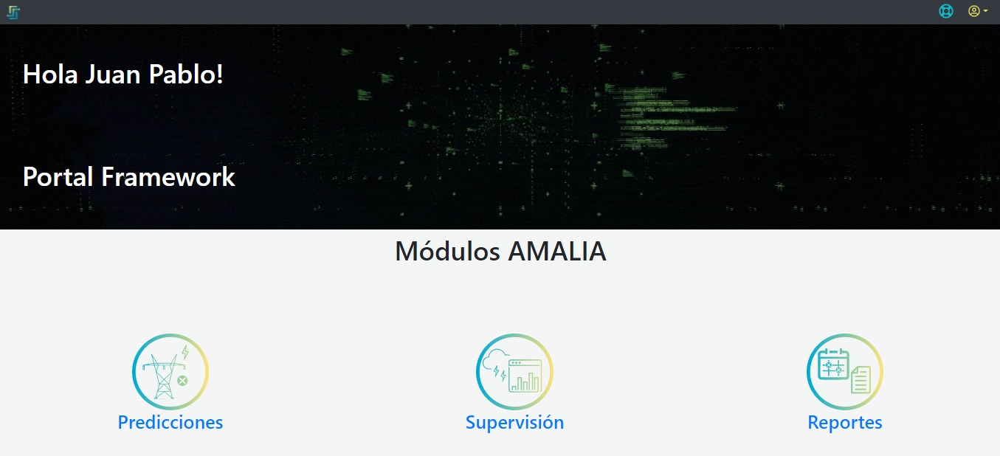

## 2. [Portal AMALIA](./docs/AMALIA/)

Ya dentro del aplicativo, AMALIA se encarga de dar la Bienvenida al usuario autenticado y mostrar los diferentes módulos dispuestos para ser usados, Predicciones, Supervisión y Reportes como se muestra en la [Figura3](../../pictures/Imagen3.png). Acá el usuario debe elegir cuál de los módulos va a consultar e ingresar a él.

**Figura 3.** *Bienvenida*