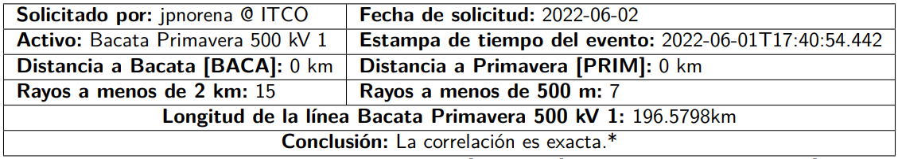
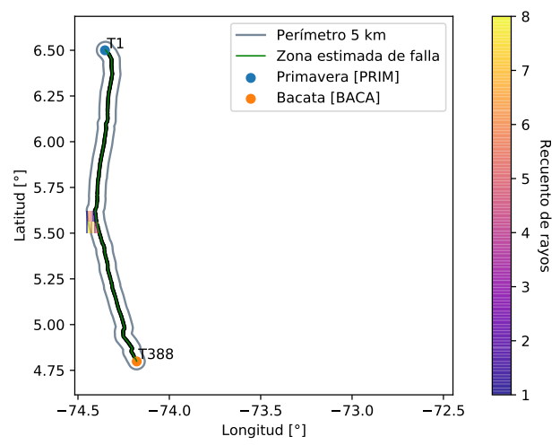
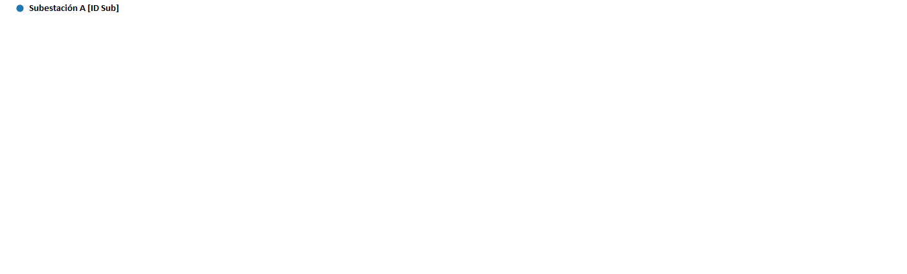
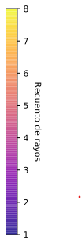
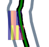

# Reporte

Cuando desde la plataforma el usuario hace correctamente la solicitud, el sistema se encarga de enviar un archivo en PDF a los correos diligenciados con la información de supervisión, la cual se explica en este documento.

## Información de solicitud
Lo primero que muestra en el reporte es la información de la consulta realizada por el usario, estos datos se presenta en la sifuiente [tabla](../../../pictures/Imagen65.png)

**Figura 56.** *Información de la consulta*

| | |
|-|-|
|**Solicitado por:** Usuario logueado en la plataforma en el momento de solicitar la consulta|**Fecha de solicitud:** fecha en formato AAAA/MM/DD del momento de solicitud de la consulta|
|**Activo:** Nombre del activo sobre el cual se está solicitando la información| **Estampa de tiempo del evento:** Estampa del evento ingresada por el usuario|
|**Distancia a [ ]:** Distancia en kilómetros hasta la subestación A ingresada por el usuario | **Distancia a [ ]:** Distancia en kilómetros hasta la subestación B ingresada por el usuario|
|**Rayos a menos de 2 km:** Cantidad de descargas atmosféricas detectadas en un perímetro menor a 2 kilómetros del activo | **Rayos a menos de 500 m:** Cantidad de descargas atmosféricas detectadas en un perímetro menor a 500 metros del activo|

||
|-|
|**Longitud de la línea:** Distancia total del activo monitoreado, va desde la subestación A hasta la subestación B|
|**Conclusión:** Probabilidad de correlación|

>**_IMPORTANTE:_**
> La celda de **Conclusión** es el único valor que es resultado de la plataforma, los demás valores de esta tabla son propios de la consulta y de los datos ingresados por el usuario.

**Figura 57.** *Clasificación de correlación*

>**_IMPORTANTE:_**
>Para determinar la probabilidad de falla se utiliza el indicador de la Densidad Dinámica de descargas (DSD) de la siguiente manera:
>a. DSD >= 0.900 --> Correlaciones exactas
>b. 0.600 >= DSD < 0.900 --> Correlaciones probables
>c. DSD < 0.600 --> No es posible correlacionar

## Tabla de descargas
En esta tabla de muestran todas las descargas de la línea consultada que tengan un SCORE superior a 0.600. Cada una de las descargas cuenta con la siguiente información:

**Figura 58.** *Tabla de descargas*

| Variable | Significado |
|-|-|
| Fecha | Estampa de tiempo estimada para la descarga con resolución de micosegundos en formato AA-MM-DD HH:MM:SS.MMM|
| Corr | Magnitud de la corriente en kiloamperios|
| Dist | Distancia longitudinal en kilómetros a la torre más cercana|
| Dist a | Distancia longitudinal en kilómetros a la subestación A|
| Dist b | Distancia longitudinal en kilómetros a la subestación B|
| Err | Error en kilómetros de la ubicación de la descarga |
| T.C | Número de la torre con la distancia longitudinal más cercana a la descarga|
| Score | Métrica que cuantifica la posible influencia de cada uno de los rayos en el evento |
| Tipo | Es el tipo de descarga NN para la Nube-Nube y NT para las Nube-Tierra|
| Polaridad | Polarización de la descarga, NEG para negativas y POS para positivas|
| Flash | Indentificación de la rama principal de la descarga |

## Mapa actividad eléctrica atmosférica
En esta ilustración se muestra el recuento de descargas atmosféricas que han caído en las cercanías de la línea. Este gráfico cuenta con:

**Figura 58.** *Actividad eléctrica atmosférica*

 1. El trazado de la línea ubicado de un plano de coordenadas de Longitud - Latitud. 
 2.  Un perímetro de 5 km alrededor de la línea, es decir 2.5 kilómetros a cada lado.
 3.  La subestación A representada en un círculo azul
 4.  La subestación B representada en un círculo naranjado
 5. 
 |||
 |-|-|
 |  | La convención de recuento de rayos es una escala de colores que va desde el mínimo número de descargas en morado, hasta el número máximo de descargas en amarillo. Estos se muestran como cuadros alrededor de la línea en donde haya actividad para dimensionar en qué lugar se concentró la tormenta.
 6.  concentración de la tormente de acuerdo a la convención de recuento de rayos
 7.  Nombre y ubicación de la primera torre del circuito
 8.  Nombre y ubicación de la última torre del circuito

## Actividad de rayos en el perímetro de 2 km a la línea

En esta ilustración se muestra el recuento de descargas atmosféricas que han caído en las cercanías de la línea. Este gráfico cuenta con:

**Figura 64.** *Actividad de rayos en el perímetro de 2 km*

 1. El trazado de la línea ubicado de un plano de coordenadas de Longitud - Latitud. 
 2. Un perímetro trazado en gris de 2 km alrededor de la línea, es decir, 1 kilómetro a cada lado.
 3. 