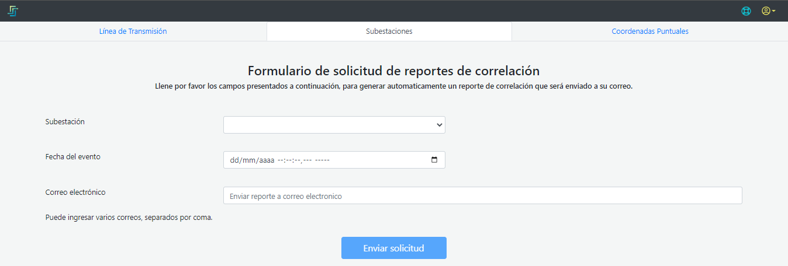
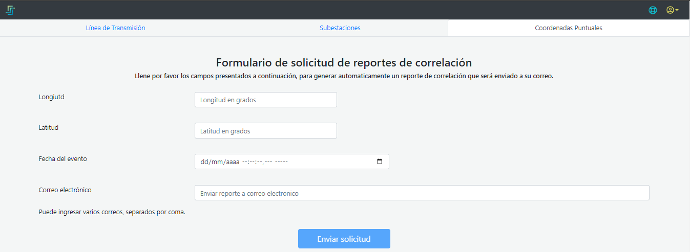
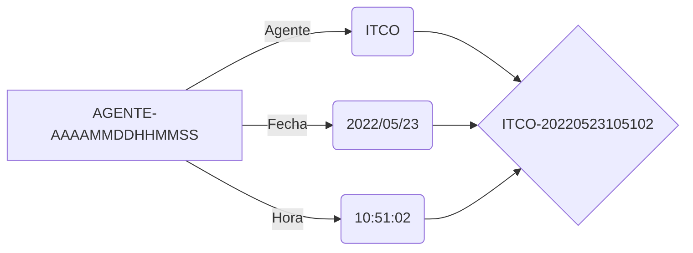

### 2.2.1 Módulo de reportes 

El módulo de reportes cuenta con la posibilidad de consultar la correlación que existe entre las descargas atmosféricas y las líneas de transmisión/distribución, subestaciones y además sobre coordenadas puntuales. Cada una de las opciones se encuentra en la parte superior de la pantalla, dependiendo de la consulta que se quiera realizar se debe elegir la opción adecuada (Línea de transmisión, Subestación o Coodenada puntual).

#### 2.2.1.1 Línea de transmisión

**Figura 4.** *Solicitud de Reporte Líneas de transmisión*

Para hacer en análisis de esta correlación se requiere contar con los siguientes datos: 

- **Línea**: Se debe seleccionar la línea de transmisión sobre la que se esté requiriendo la información de correlación. La plataforma ofrece una lista desplegable con todas las líneas que se encuentran monitoreadas de tal forma que el usuario pueda buscar la de su interés.  
Estas líneas guardan la misma convención de nombre que usa el cliente, 4 letras para el ID de identificación de la subestación A, 4 letras para el ID de identificación de la subestación B, el valor del voltaje de la línea y el número de la línea.  

- **Fecha del evento**: Corresponde a la fecha completa en la que se detectó un evento de falla o salida de línea en el activo que se está correlacionando. Este dato tiene resolución de microsegundos en un formato de Dia/Mes/Año Hora:Minuto:Segundo.Microsegundo. 

    >*IMPORTANTE*: Aunque el dato admite valores hasta los microsegundos, solo es obligatorio llenar la información hasta los segundos, es importante tener en cuenta esto, ya que el sistema no hace el cálculo de correlaciones para resoluciones minutales. 

- **Distancias a las subestaciones**: Tanto la distancia a la subestación A como a la subestación B son las medidas en kilómetros estimadas por los elementos de protección. 

    >*IMPORTANTE*: Se debe tener en cuenta que la suma de las dos distancias a las subestaciones no debe ser mayor a la longitud de la línea ni menor que ella. 

- **Correo electrónico**: esta campo está dispuesto para escribir todos los correos electrónicos a los que se quiere que se envíe el informe solicitado, si son varios correos, estos deben ir separados por coma (**,**) entre sí.

#### 2.2.1.2 Subestaciones

**Figura 4.** *Solicitud de Reportes para subestaciones*

Para hacer en análisis de esta correlación se requiere contar con los siguientes datos: 

- **Subestación**: Se debe seleccionar la subestación sobre la que se esté requiriendo la información de correlación. La plataforma ofrece una lista desplegable con todas las subestaciones que se encuentran monitoreadas de tal forma que el usuario pueda buscar la de su interés.  
Estas subestaciones guardan la misma convención de nombre que usa el cliente, 4 letras para el ID de identificación.  

- **Fecha del evento**: Corresponde a la fecha completa en la que se detectó un evento de falla o salida de línea en el activo que se está correlacionando. Este dato tiene resolución de microsegundos en un formato de Dia/Mes/Año Hora:Minuto:Segundo.Microsegundo. 

    >*IMPORTANTE*: Aunque el dato admite valores hasta los microsegundos, solo es obligatorio llenar la información hasta los segundos, es importante tener en cuenta esto, ya que el sistema no hace el cálculo de correlaciones para resoluciones minutales. 

- **Correo electrónico**: esta campo está dispuesto para escribir todos los correos electrónicos a los que se quiere que se envíe el informe solicitado, si son varios correos, estos deben ir separados por coma (**,**) entre sí.

#### 2.2.1.3 Coordenada Puntual

**Figura 4.** *Solicitud de Reportes para coordenadas puntuales*

Para hacer en análisis de esta correlación se requiere contar con los siguientes datos: 

- **Longitud**: Se debe ingresar el valor decimal de la longitud correspondiente a la coordenada sobre la cual se quiere realizar la consulta. Si este valor es de carácter decimal es necesario usar el punto (**.**) en lugar de la coma.

- **Latitud**: Se debe ingresar el valor decimal de la latitud correspondiente a la coordenada sobre la cual se quiere realizar la consulta. Si este valor es de carácter decimal es necesario usar el punto (**.**) en lugar de la coma.

- **Fecha del evento**: Corresponde a la fecha completa en la que se detectó un evento de falla o salida de línea en el activo que se está correlacionando. Este dato tiene resolución de microsegundos en un formato de Dia/Mes/Año Hora:Minuto:Segundo.Microsegundo. 

    >*IMPORTANTE*: Aunque el dato admite valores hasta los microsegundos, solo es obligatorio llenar la información hasta los segundos, es importante tener en cuenta esto, ya que el sistema no hace el cálculo de correlaciones para resoluciones minutales. 

- **Correo electrónico**: esta campo está dispuesto para escribir todos los correos electrónicos a los que se quiere que se envíe el informe solicitado, si son varios correos, estos deben ir separados por coma (**,**) entre sí.

Luego de haber ingresado todos los datos y pulsar el botón **Enviar Formulario** la plataforma se encarga de hacer la consulta de la información para generar el reporte, si los datos ingresados están correctos sale una [ventana emergente](../../../pictures/Imagen5.png) y se realiza el envío del reporte con la información solicitada.

**Figura 5.** *Confirmación de Reporte Enviado*

La ventana energente muestra el número del reporte generado que contiene una estrutura de nombre  de la siguientes manera:

#### 2.2.1.4. Errores

##### **Sesion expirada**: 
La plataforma tiene una vigencia de sesión de 45 minutos, razón por la cual despúes de este tiempo, el usuario deberá recargar la página y volver a identificarse, de lo contrario al intentar sacar un reporte, la plataforma no estará habilitada y mostrará una ventana emergente solicitando una nueva autenticación, tal como se ve en la [Figura6](../../../pictures/Imagen5.png).

**Figura 6.** *Sesion Expirada*

##### **Error en el reporte**: 
- *Distancia erronea*: 
Si la suma de las distancias a las subestaciones ingresadas es mayor que el doble de la logitud de la línea, el sistema no va a poder realizar la consulta y se debe repetir el formulario corrigiendo esta información
- *Tiempo erroneo*: 
Si la estampa de tiempo ingresada es anterior a la fecha en que el activo se empezó a monitorear o, por el contrario, la estampa de tiempo ingresada es menor a 45 minutos de la hora en la que se está haciendo la consulta el sistema no encuentra datos y por lo tanto arroja un error para llenar nuevamente el formulario.