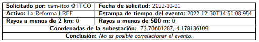
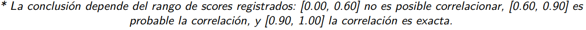
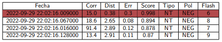
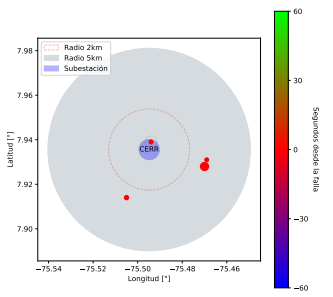
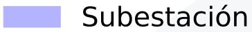
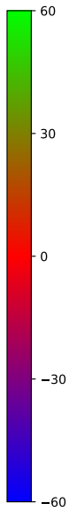
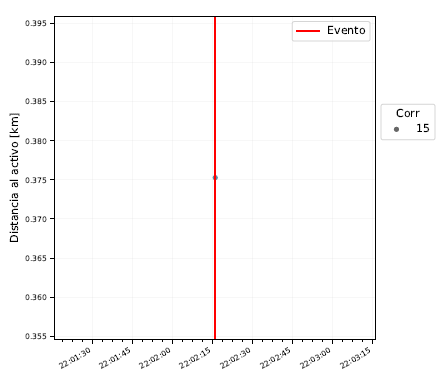

# Subestación

Cuando desde la plataforma el usuario hace correctamente la solicitud, el sistema se encarga de enviar un archivo en PDF a los correos diligenciados con la información de supervisión, la cual se explica en este documento.

## Información de solicitud
Lo primero que muestra en el reporte es la información de la consulta realizada por el usuario, estos datos se presenta en la siguiente [tabla](../../../pictures/Imagen79.png)

**Figura 79.** *Información de la consulta*

| | |
|-|-|
|**Solicitado por:** Usuario logueado en la plataforma en el momento de solicitar la consulta|**Fecha de solicitud:** fecha en formato AAAA/MM/DD del momento de solicitud de la consulta|
|**Activo:** Nombre del activo sobre el cual se está solicitando la información| **Estampa de tiempo del evento:** Estampa del evento ingresada por el usuario|
|**Rayos a menos de 2 km:** Cantidad de descargas atmosféricas detectadas en un perímetro menor a 2 kilómetros del activo | **Rayos a menos de 500 m:** Cantidad de descargas atmosféricas detectadas en un perímetro menor a 500 metros del activo|

||
|-|
|**Coordenadas de la subestación:** Es el punto de longitud y latitud en el que está situada la subestación consultada|
|**Conclusión:** Probabilidad de correlación|

>**_IMPORTANTE:_**
> La celda de **Conclusión** es el único valor que es resultado de la plataforma, los demás valores de esta tabla son propios de la consulta y de los datos ingresados por el usuario.

**Figura 57.** *Clasificación de correlación*

>**_IMPORTANTE:_**
>Para determinar la probabilidad de falla se utiliza el indicador de la Densidad Dinámica de descargas (DSD) de la siguiente manera:
>a. DSD >= 0.900 --> Correlaciones exactas
>b. 0.600 >= DSD < 0.900 --> Correlaciones probables
>c. DSD < 0.600 --> No es posible correlacionar

## Tabla de descargas
En esta tabla de muestran todas las descargas de la línea consultada que tengan un SCORE superior a 0.600. Cada una de las descargas cuenta con la siguiente información:

**Figura 80.** *Tabla de descargas*

| Variable | Significado |
|-|-|
| Fecha | Estampa de tiempo estimada para la descarga con resolución de micosegundos en formato AA-MM-DD HH:MM:SS.MMM|
| Corr | Magnitud de la corriente en kiloamperios|
| Dist | Distancia longitudinal en kilómetros a la torre más cercana|
| Err | Error en kilómetros de la ubicación de la descarga |
| Score | Métrica que cuantifica la posible influencia de cada uno de los rayos en el evento |
| Tipo | Es el tipo de descarga NN para la Nube-Nube y NT para las Nube-Tierra|
| Polaridad | Polarización de la descarga, NEG para negativas y POS para positivas|
| Flash | Indentificación de la rama principal de la descarga |

## Reporte de eficiencia de la red
El reporte de eficiencia es una tabla que consulta en todos los departamentos donde se hayan presentado descargas el porcentaje de detección de la red, esta consulta se realiza para la ventana de tiempo correspondiente a los 60 minutos anteriores a la estapa de tiempo de la falla. 
| Departamento | % Eficiencia |
|-|-|
| Nombre del departamento | Porcentaje de eficiencia de la red de detección|

## Mapa actividad eléctrica atmosférica
En esta ilustración se muestra el recuento de descargas atmosféricas que han caído en las cercanías de la subestación. Este gráfico cuenta con:

**Figura 58.** *Actividad eléctrica atmosférica*

 1. El trazado de la línea ubicado de un plano de coordenadas de Longitud - Latitud. 
 2.  Un perímetro circular de 2 km alrededor de la subestación.
 3.  Un área circular de 5 km alrededor de la subestación
 4.  La ubucación de la subestación
 5. 
 |||
 |-|-|
 |  | La convención de estampa de tiempo de rayos es una escala de colores que va desde 60 segundos antes de la estapa de tiempo de la falla en morado, hasta 60 segundos después de la estampa de tiempo del evento en verde. Estos se muestran como círculos alrededor de la subestación en donde haya actividad para dimensionar en qué lugar se concentró la tormenta.

## Información temporal de descargas

En esta gráfica de burbujas se muestran los datos corresponientes a la magnitud de corriente de las descargas (representado en el diámetro de la burbuja), la cercanía en distancia a la subestación (eje Y) y en cercanía en tiempo a la estampa de tiempo de la falla (eje X), sobre la gráfica hay una línea roja que representa la estapa de tiempo ingresada en la consulta.

