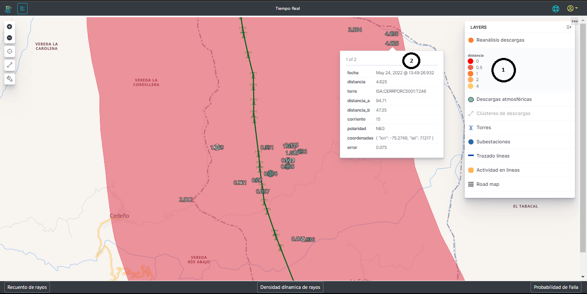

# 2.2.2. Reanálisis de desarcagas
Esta función de la plataforma se encarga de relacionar todas las descargas atmosféricas que se han detectado y almacenado con los activos que se tienen monitoreados, de tal forma que cada una de la descarga tenga información con base en los diferentes activos y de pueda ver la influencia que cada una de las descargas tiene con los elementos monitoreados, en la [Figura 10](../../../pictures/Imagen10.png)

Como esta información contiene la información de las descargas respecto a los activos, para esta capa contenga información visible, es necesario tener un acercamiento suficiente para que se vean las descargas discriminadas, los trazados y las torres de cada una de las líneas tal como se ve en la [Figura 10](../../../pictures/Imagen10.png). 

**Figura 11.** *Reanálisis de descargas*

##  *1. Distancia*:
Tabla de convención dinámica de acuerdo a las descargas que hay en la ventana de tiempo consultada en todo el territorio. Estos valores varían con respecto a la mayor y menor distacia de las descargas a los activos, de tal forma que los círculos que representan las descargas van a tomar esos colores.

## *2. Información de la descarga*:
En la capa del reanálisis de las descargas, cada una tiene un número que la representa, este número es la distancia radia en kilómetros al activo más cercano. Cuando se hace click sobre la descarga o se para sobre ella, esta despliega la información de la misma. En esta información se encuentra:

- **_Fecha:_** La estampa de tiempo en la que la descarga se presentó.
- **_Distancia:_-** Este valor es el mismo que tiene la descaga y es la distancia en kilómetros al activo (torre) más cercana.
- **_Torre:_** Hace referencia al activo más cercano relacionado con la descarga y muestra el nombre con la no####menclatura de cliente.
- **_Distancia-a:_** es la distancia en kilómetros a la subestación A de la línea de transmisión
- **_Distancia-b:_** es la distancia en kilómetros a la subestación B de la línea de transmisión
- **_Corriente:_** Es la magnitud de la corriente de Kiloamperios de la descarga.
- **_Polaridad:_** Hace raferencia a la polaridad de la descarga. Neg para descargas negativas y POS para descargas positivas.
- **_Coordenadas:_** son los valores de longitud y latitud que determinan la posición estimada de la caída del rayo
- **_Error:_** es el valor en kilómetros del error en la ubicación de la descarga, es decir, la descarga pudo haber caido dentro de una circunferencia con radio del valor del error en kilómetros.