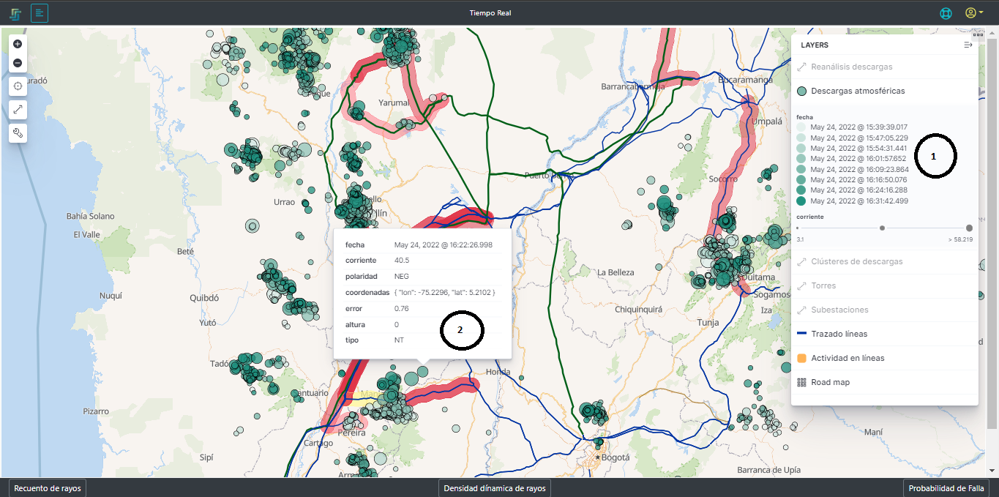
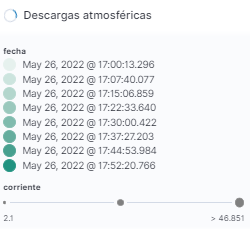
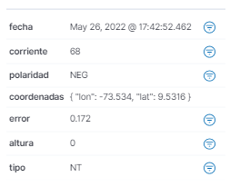

## 2.2.3. Descargas atmosféricas
Esta función de la plataforma se encarga de mostrar todas las descargas atmosféricas que se han detectado y almacenado con la información básica de la descarga, así se puede ver en en la [Figura 14](../../../pictures/Imagen14.png)

Como esta capa contiene la información de las descargas es necesario llegar a un nivel de zoom tal que no se vean los cluster sino las descargas individuales [Figura 14](../../../pictures/Imagen14.png).

**Figura 14.** *Descargas atmosféricas*

###  *1. Fecha*:

**Figura 14.** *Convención de estampa de tiempo*

Tabla de convención dinámica de acuerdo a las descargas que hay en la ventana de tiempo consultada en todo el territorio. Estos valores de estampa de tiempo varían con respecto a la descarga más reciente hasta la antigua, de tal forma que los círculos que representan las descargas van a tomar esos colores.
Además el tamaño del círculo representa la magnitud de la corriente de cada una de las descargas.

### *2. Información de la descarga*:

**Figura 16.** *Información de la descarga*

- **_Fecha:_** La estampa de tiempo en la que la descarga se presentó.
- **_Corriente:_** Es la magnitud de la corriente de Kiloamperios de la descarga.
- **_Polaridad:_** Hace raferencia a la polaridad de la descarga. Neg para descargas negativas y POS para descargas positivas.
- **_Coordenadas:_** son los valores de longitud y latitud que determinan la posición estimada de la caída del rayo
- **_Error:_** es el valor en kilómetros del error en la ubicación de la descarga, es decir, la descarga pudo haber caido dentro de una circunferencia con radio del valor del error en kilómetros.
- **_Altura:_** es el valor en metros sobre el nivel del mar para la ubicación de las descargas tipo nube nube (NN)
- **_Tipo:_** Hace raferencia al tipo descarga. NT para descargas que son tipo Nube Tierra y NN para descargas que son de tipo Nube Nube.