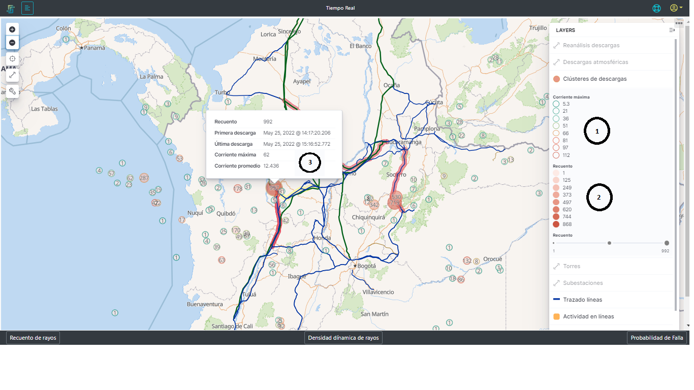
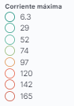

# 2.2.4. Clusterización de descargas
Esta función de la plataforma se encarga de agrupar las descargas que han sido obtenidas por el sistema en clusters de acuerdo a su ubicación geofráfica de las mismas, esta clusterización informa la cantidad de rayos que hay en cada cluster y sus características de corriente tal como se muestra en la [Figura 16](../../../pictures/Imagen16.png.png)

Como esta capa contiene la información los grupos de descargas, para que sea visible, es necesario estar lo suficientemente alejando para que las descargas se puedan agrupar, tal como se ve en la [Figura 16](../../../pictures/Imagen16.png). 

**Figura 16.** *Clusters de descargas*
##  *1. Corriente máxima*:

**Figura 15.** *Convención de corriente máxima*

Tabla de convención dinámica de acuerdo a los grupos (clusters) que hay en la ventana de tiempo consultada en todo el territorio. Estos valores varían con respecto a las máximas corrientes de cada uno de los grupos de dercargas, de tal forma que las circunferencias (contorno de los círculos) que representan los clusters de descargas van a tomar esos colores.

## *2. Recuento*:

**Figura 16.** *Convención de recuento de descargas*

Tabla de convención dinámica de acuerdo a los grupos (clusters) que hay en la ventana de tiempo consultada en todo el territorio. Estos valores varían con respecto a la cantidad de descargas que componen el cluster desde el cluster con mayor número de descargas y el menor , de tal forma que los círculos que representan los clusters de descargas van a tomar esos colores.
Además, el tamaño de la circunferencia hace referencia a la cantidad de rayos que han caído en la zona.

## *3. Información del cluster*:
En la capa del cluster de las descargas, cada una tiene un número que la representa, este número es la cantidad de rayos dentro de este cluster. Cuando se hace click sobre el cluster o se para sobre él, este despliega la información del mismo. En esta información se encuentra:

**Figura 16.** *Información del cluster*
- **_Recuento:_** Cantidad de descargas para el periodo de tiempo seleccionado y la región geográfica comprendida por la circunferencia.
- **_Primera descarga:_** estampa de tiempo de la primera descarga para el periodo de tiempo seleccionado y la región geográfica comprendida por la circunferencia.
- **_Última descarga:_** estampa de tiempo de la última descarga para el periodo de tiempo seleccionado y la región geográfica comprendida por la circunferencia.
    >*IMPORTANTE:* los dos datos anteriores brinda la información de la duración de la tormenta para la región geográfica comprendida por la circunferencia.
- **_Corriente Máxima:_** es la magnitud de la corriente máxima de todos los rayos contenidos en el cluster.
- **_Corriente promedio:_** es la magnitud de la corriente promedio de todos los rayos contenidos en el cluster.