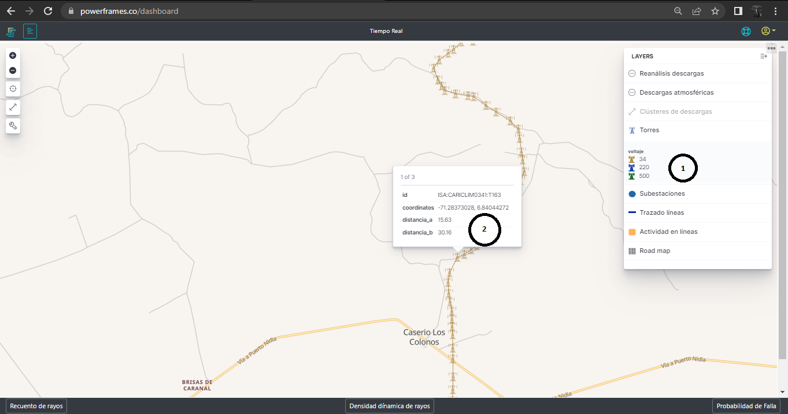
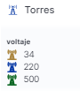
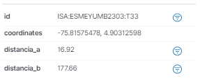

# 2.2.3. Torres
Esta capa de la plataforma se encarga de mostrar la ubicación de las torres de acuerdo con su ubicación geofráfica y altura sobre el nivel del mar, tal como se muestra en la [Figura 17](../../../pictures/Imagen17.png.)

Como esta capa contiene la información de las torres monitoreadas es necesario llegar a un nivel de zoom tal que se vean los símbolos que representan las torres .

**Figura 17.** *Torres*

##  *1. Voltaje*:
Tabla de convención de acuerdo a los voltajes en Kilovoltios de las las torres supervisadas.

**Figura 18.** *Convención de torres*

## *3. Información de la torre*:

Cuando se hace click sobre la torre o se para sobre ella, esta despliega la información de la misma. En esta información se encuentra:

**Figura 19.** *Información de las torres*

- **_ID:_** Es la identificación de la torre en la que se indica el agente, el circuito y el número de la torre
- **_Coordinates:_** son los valores de longitud y latitud que determinan la posición de la torre
- **_Distancia-a:_** es la distancia en kilómetros a la subestación A de la línea de transmisión
- **_Distancia-b:_** es la distancia en kilómetros a la subestación B de la línea de transmisión