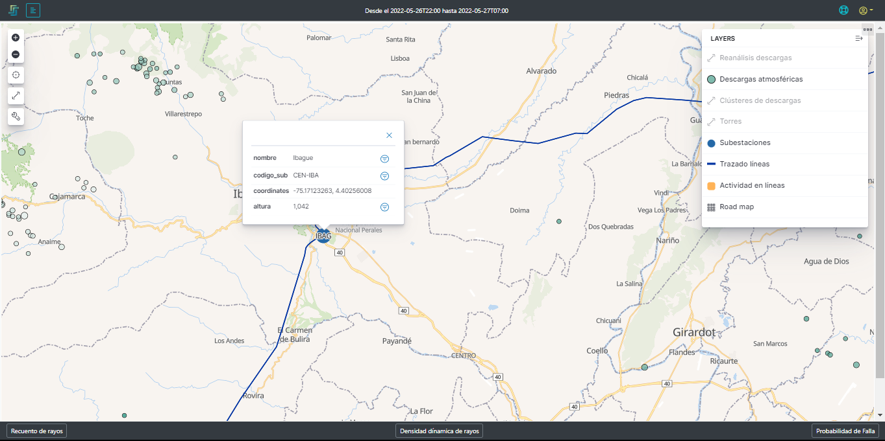
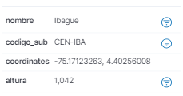

# 2.2.6. Torres
Esta capa de la plataforma se encarga de mostrar la ubicación de las subestaciones de acuerdo con su ubicación geofráfica y altura sobre el nivel del mar, tal como se muestra en la [Figura 20](../../../pictures/Imagen35.png.)

Como esta capa contiene la información de las subestaciones monitoreadas es necesario llegar a un nivel de zoom tal que se vean los símbolos que representan las torres .

**Figura 20.** *Subestaciones*

## *3. Información de la subestación*:

Cuando se hace click sobre la subestación o se para sobre ella, esta despliega la información de la misma. En esta información se encuentra:

**Figura 19.** *Información de las subestaciones*

- **_Nombre:_** Es el nombre de la identificación de la subestación.
- **_Código-Sub:_** Es el código de identificación de la subestación
- **_Coordenadas:_** Son las coordenadas de longitud y latitud de la subestación
- **_Altura:_** Es la medida en metros sobre el nivel del mar (MSNM) de la subestación