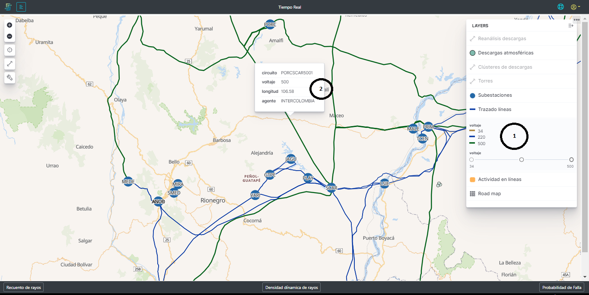
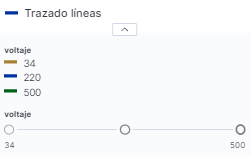
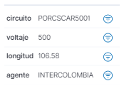
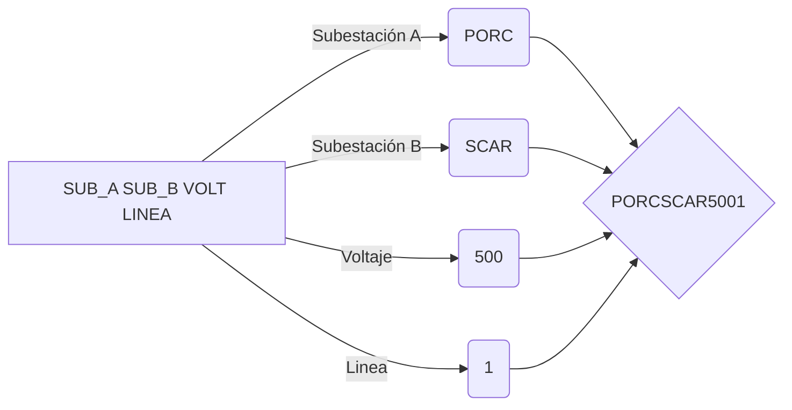

# 2.2.7. Trazado de Líneas
Esta capa de la plataforma se encarga de mostrar el trazado de cada una de las líneas dde transmisión y distribución supervidsdadas, su ubicación geofráfica, longitud, torres que la componen y subestaciones de inicio y fin de la línea, tal como se muestra en la [Figura 22](../../../pictures/Imagen39.png). Como esta capa contiene la información de los trazados, se puede observar en cualquier nivel de zoom.

**Figura 22.** *Trazado de líneas*

##  *1. Voltaje*:
Tabla de convención de acuerdo a los voltajes en Kilovoltios de las líneas supervisadas.

**Figura 23.** *Convención de líneas*

## *2. Información de la línea*:

Cuando se hace click sobre la línea o se para sobre ella, esta despliega la información de la misma. En esta información se encuentra:

**Figura 24.** *Información de las líneas*

- **_Circuito:_** Es el nombre de la linea de transmisión.

> IMPORTANTE: las primeras cuatro letras indentifican la subestación A, las segundas 4 letras la subestación B, los número el voltaje en kilovoltios y el último número es el número de la línea.
- **_Voltaje:_** Es el voltaje en kilovoltios de la línea
- **_longitud:_** Es la medida longitudinal que tiene la línea desde la subestación A a la subestación B
- **_Agente:_** Es el encargado de la supervisión de la línea.