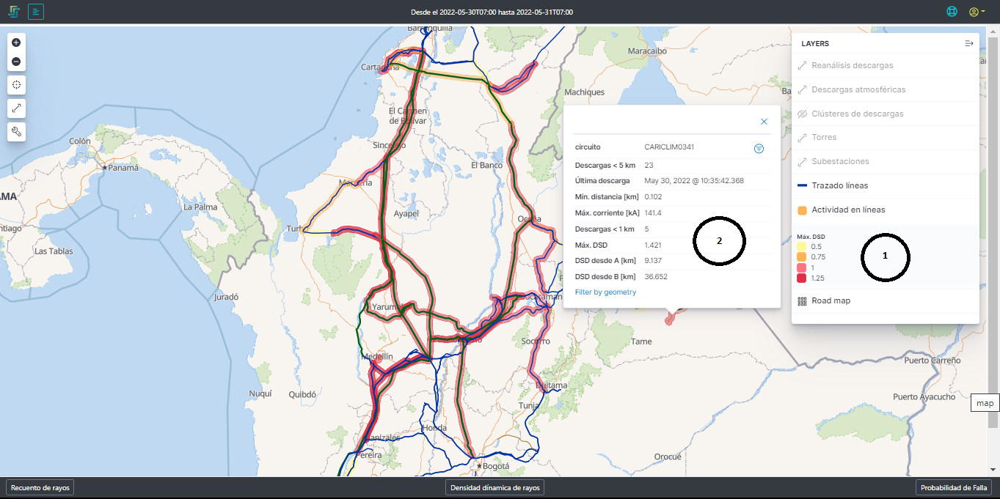
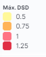
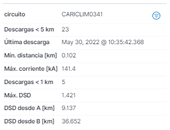
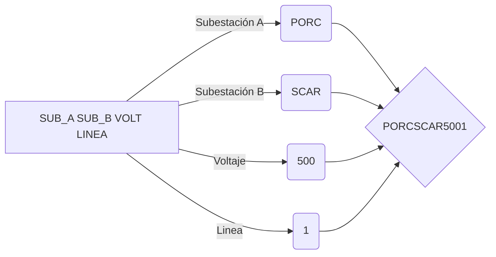

# 2.2.8. Actividad en las Líneas
Esta capa de la plataforma busca informar sobre el estado que tiene cada una de las líneas de transmisión en cuanto a descargas atmosféricas cercanas a ella. tal como se muestra en la [Figura 25](../../../pictures/Imagen42.png), las líneas tiene un color que las resalta si están bajo ciartas condiciones de vulnerabilidad de acuerdo con las descargas. Como esta capa contiene la información sobre la actividad en los trazados, se puede observar en cualquier nivel de zoom.

**Figura 25.** *Actividad en las líneas*

##  *1. Max. DSD*:
Tabla de convención de acuerdo a la Densidad Dinamica de Descargas (DSD).

**Figura 26.** *Convención de antividad en líneas*

## *2. Información de la actividad sobre la línea*:

Cuando se hace click sobre la línea o se para sobre ella, esta despliega la información de la actividad presente por descargas atmosférucas cerca a ella. En esta información se encuentra:

**Figura 27.** *Información de la actividad en las líneas*

- **_Circuito:_** Es el nombre de la linea de transmisión.

> IMPORTANTE: las primeras cuatro letras indentifican la subestación A, las segundas 4 letras la subestación B, los número el voltaje en kilovoltios y el último número es el número de la línea.
- **_Descargas < 5 km:_** Es la cantidad de rayos que se ubican a menos de 5 kilometros radiales de la línea
- **_Última descarga:_** Es la descarga más recientemente detectada en la franja de tiempo seleccionada.
- **_Min. Distancia [Km]:_** Es la distancia en kilómetros del rayo más cercano a la línea 
- **_Max. Corriente [KA]:_** El la magnitud de la corriente máxima de las descargas detectadas a menos de 5 km de la línea
- **_Descargas < 1 km:_** Es la cantidad de rayos que se ubican a menos de 5 kilometros radiales de la línea
- **_Max. DSD:_** es el valor máximo de la Densidad Dinamica de Descargas para la línea.
- **_DSD desde A [Km]:_** Es la distancia longitudinal desde la subestación A hasta donde se detecta el DSD máximo
- **_DSD desde B [Km]:_** Es la distancia longitudinal desde la subestación B hasta donde se detecta el DSD máximo