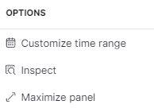
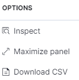

# 2.2.8. Datos
Este submódulo de AMALIA es el encargado de almacenar los datos crudos de las descargas que se detectan. Como son datos que aún no han sido procesados cuentan con la información propia de la medida sin relacionarse con los activos supervisados, tal como se muestra en la [Figura 28](../../../pictures/Imagen46.png).

**Figura 25.** *Submódulo de Datos*

## *2.2.8.1. Gráfica*:
Se muestra una gráfica de barras con la infomación de las descargas, el el eje vertical está el recuento de rayos y en el eje horizontal está la estampa de tiempo con resolución ajustable a la ventana de tiempo seleccionada.

Las barras verdes muestran la cantidad de descargas NT (nube tierra) detectadas, mientras que las azules muestran los rayos NN (Nube Nube). 

**Figura 26.** *Gráfica de datos crudos*

### Las convenciones 
Ofrecen las siguientes opciones para el usuario:

- **_Dar Click:_** 
-- *_Personalizar  :_* Permite cambiar el color de las barras para el preferido por el usuario
-- *_Filtrar  :_* Permite filtrar los datos mostrados en la gráfica por el ítem seleccionado
-- *_Eliminar filtro  :_* Permite quitar el filtro de los datos en la gráfica por el ítem seleccionado

- **_Pasar el cursor:_** Reslata en la gráfica la serie de datos del elemento de la convención sobre el que se está parado.

### Herramientas
Ofrecen las siguientes opciones para el usuario:

 
- *_Customize time range  :_* Permite configurar la ventana de tiempo de consulta.
    >*IMPORTANTE:* esto personalización de tiempo **SOLO** cambia los datos de la gráfica.

- *_Inspect  :_* Herramienta de control para desarrollo, ofrece información de cómo se están suministrando la información a la visualización. 
    >IMPORTANTE: se recomienda no usar esta herramienta.

- *_Maximize panel  :_* Maximiza la visualización de la gráfica de barras para que esta ocupe la pantalla completa del navegador.

## *2.2.8.2. Datos*:

Se muestra una tabla de datos con la infomación de las descargas, en la tabla se pueden encontrar los datos de estampa de tiempo, coordenadas, corriente, polaridad, tipo, altura y error.

**Figura 30.** *Tabla de datos*

### Opciones

Ofrece las siguientes opciones para el usuario:

 
- *_Inspect  :_* Herramienta de control para desarrollo, ofrece información de cómo se están suministrando la información a la visualización. 
    >IMPORTANTE: se recomienda no usar esta herramienta.

- *_Maximize panel  :_* Maximiza la visualización de la gráfica de barras para que esta ocupe la pantalla completa del navegador.

- *_Download CSV  :_* herramienta que permite descargar en una archivo tipo CSV los datos crudos de las descargas con la ventana de tiempo señeccionada.
    >*IMPORTANTE:* Esta opción solo permite la descarga de 10.000 datos.

