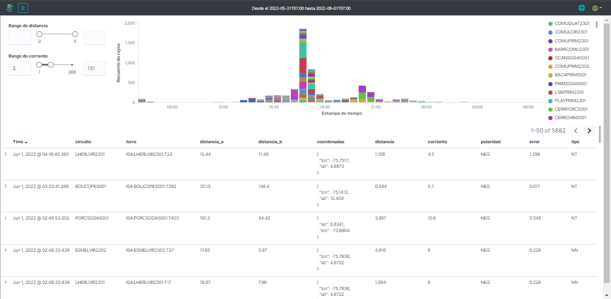
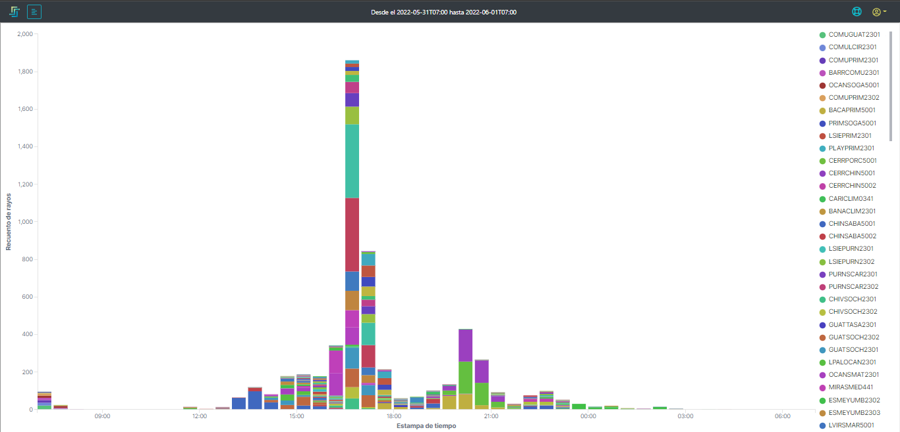
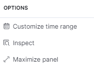
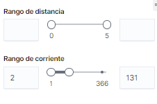
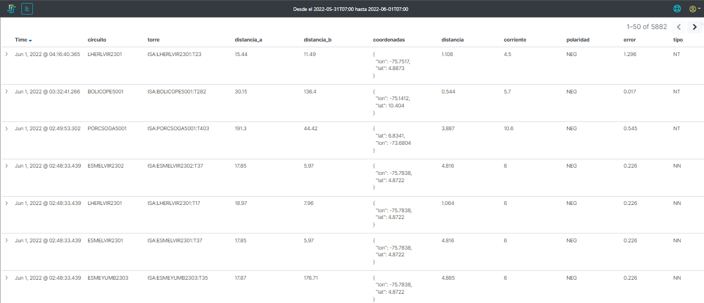
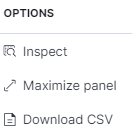

# 2.2.10. Reanálisis
Este submódulo de AMALIA se encarga de analizar la información de todas las descargas atmosféricas y relacionarlas con los activos supervisados como se puede observar en la [Figura 30](../../../pictures/Imagen59.png).

**Figura 25.** *Submódulo de Reanálisis*

## *2.2.8.1. Gráfica*:
Se muestra una gráfica de barras con la infomación de las descargas, el el eje vertical está el recuento de rayos y en el eje horizontal está la estampa de tiempo con resolución ajustable a la ventana de tiempo seleccionada.

Las barras multicolores muestran la cantidad de descargas se detectan en perímetros de 5 km alrededor de los activos monitoreados. 

**Figura 26.** *Gráfica de datos analizados*

### Las convenciones (nombre de los activos)
Ofrecen las siguientes opciones para el usuario:

#### **_Dar Click:_** 
- *_Personalizar  :_* Permite cambiar el color de las barras para el preferido por el usuario
- *_Filtrar  :_* Permite filtrar los datos mostrados en la gráfica por el ítem seleccionado
- *_Eliminar filtro  :_* Permite quitar el filtro de los datos en la gráfica por el ítem seleccionado

#### **_Pasar el cursor:_** 
Reslata en la gráfica la serie de datos del elemento de la convención sobre el que se está parado.

### Filtros
Ofrecen las siguientes opciones para el usuario:

- *_Rango de distancia:_* modifica el rango de distancia permitido para las descargas cercanas a la línea, es decir, ajusta el perímetro de análisis entre 0 y 5 km del activo supervisado.

- *_Rango de corriente:_* modifica el rango de la magnitud de la corriente permitido para las descargas cercanas a la línea, es decir, ajusta el valor de la corriente entre el mínimo y el máximo en kiloamperios para la ventana de tiempo consultada.

### Herramientas
Ofrecen las siguientes opciones para el usuario:

 
- *_Customize time range  :_* Permite configurar la ventana de tiempo de consulta.
    >*IMPORTANTE:* esto personalización de tiempo **SOLO** cambia los datos de la gráfica.

- *_Inspect  :_* Herramienta de control para desarrollo, ofrece información de cómo se están suministrando la información a la visualización. 
    >IMPORTANTE: se recomienda no usar esta herramienta.

- *_Maximize panel  :_* Maximiza la visualización de la gráfica de barras para que esta ocupe la pantalla completa del navegador.

## *2.2.8.2. Datos*:

Se muestra una tabla de datos con la infomación de las descargas respecto a los activos monitoreados, en la tabla se pueden encontrar los datos de estampa de tiempo, circuito cercano a la descarga, torre cercan a la descarga, distancia longitudinal a la subestación A, distancia longitudinal a la subestación B, coordenadas, distancia radial a la torre más cercana, corriente, polaridad, tipo, altura y error.

**Figura 30.** *Tabla de datos*

### Opciones

Ofrece las siguientes opciones para el usuario:

 
- *_Inspect  :_* Herramienta de control para desarrollo, ofrece información de cómo se están suministrando la información a la visualización. 
    >IMPORTANTE: se recomienda no usar esta herramienta.

- *_Maximize panel  :_* Maximiza la visualización de la gráfica de barras para que esta ocupe la pantalla completa del navegador.

- *_Download CSV  :_* herramienta que permite descargar en una archivo tipo CSV los datos crudos de las descargas con la ventana de tiempo señeccionada.
    >*IMPORTANTE:* Esta opción solo permite la descarga de 10.000 datos.