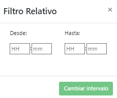
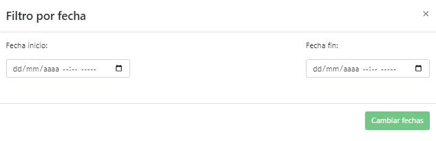

# 2.2.13. Filtro Relativo
El filtro relativo tiene como propósito hacer una consulta con una ventana de tiempo respecto al tiempo actual, por esta razón cuando se utiliza este filtro solo se solicita una hora desde y una hora hasta, ambas teniendo como referencia el momento en el que se realiza la consulta. [Figura 40](../../../pictures/Imagen63.png).

**Figura 40.** *Filtro de tiempo relativo*

> Si se asume que la hora de consulta es 1 de junio de 2022 a las 08:20 am (01/06/2022 08:00) entonces el filtro relativo tiene los siguientes datos de consulta:
> *__IMPORTANTE:__* 
> - Si los datos de HASTA se dejan en 0, se toma la hora actual de consulta.
> - El tiempo en HASTA debe ser menor que el tiempo en DESDE.

 |Desde HH | Desde MM | Hasta HH | Hasta MM |Ventana tiempo| 
|-:| -: | -: | -: | -:|
|01|00|00|00|Ini:31/05/2022 07:00 Fin:31/05/2022 08:00
|18|23|00|00|Ini:30/05/2022 13:37 Fin:31/05/2022 08:00
|01|30|00|30|Ini:31/05/2022 06:30 Fin:31/05/2022 07:30
|00|45|00|15|Ini:31/05/2022 07:15 Fin:31/05/2022 07:45

# 2.2.13. Filtro Absoluto
El filtro absoluto tiene como propósito hacer una consulta con una ventana de tiempodeterminada por el usuario, por esta razón cuando se utiliza este filtro se solicitan la estampa de tiempo de inicio y de fin de la consulta. [Figura 41](../../../pictures/Imagen64.png).

    > *__IMPORTANTE:__* Se recomienda tener configurada la hora del computador en horario de formato 24 horas (hora militar) para que no hayan conflictos con los tiempo de consulta

**Figura 41.** *Filtro de tiempo absoluto*