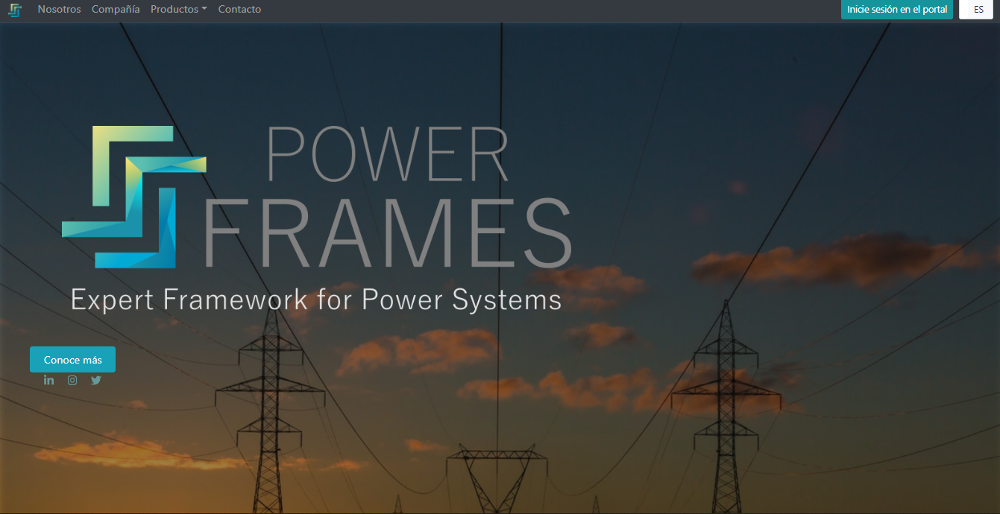
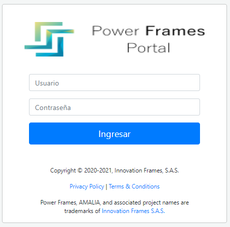

## 1. Entrada al aplicativo
Este servicio es una aplicación web que es recomendada para ser usada en navegadores basados en **Chromium** como [Google Chrome.](https://www.google.com/intl/es_es/chrome/), [EDGE](https://www.microsoft.com/es-es/edge), [BRAVE](https://brave.com/es/), [OPERA](https://www.opera.com/es) y  [SRWare Iron](https://www.srware.net/iron/), entre otros. 
Para acceder al aplicativo se debe ingresar a la URL [www.powerframes.co](http://www.powerframes.co/)

Después de estar en el portal principal del aplicativo es necesario acceder, para hacerlo, el usuario debe de hacer uso de sus credenciales de acceso (usuario y contraseña) que han sido suministradas.

• IMPORTANTE: En caso el usuario no tenga credenciales de acceso y la empresa ya se encuentre afiliada a nuestra base de datos, debe de ponerse en contacto con el usuario administrador de dicha empresa para solicitarle las credenciales.

## 2.1. Portal de entrada

Al encontrarse en la página principal del aplicativo siguiendo las indicaciones anteriores podrá ver el portal de entrada a la aplicación, desde donde puede acceder con sus credenciales.

### 2.1.1. Botones disponibles

**Nosotros**: acá podrá conocer un poco más de la empresa, en esta opción va a encontrar información, además de un vídeo de presentación.

**Compañía**: los clientes principales, los proveedores, el respaldo, la experiencia, la visión y la estructura de la empresa puede ser consultada en esta opción.

**Productos**: La descripción de los productos, la infraestructura y la arquitectura que usan en cada uno de los productos se muestran en este apartado.

**Contacto**: Los datos donde puede encontrar la solución a las dudas o cualquier información pertinente está desplegado en esta opción.

## 2.1.2 Acceso

Una vez seleccionada la opción **“Inicie sesión en el portal”**, ubicada en la parte superior derecha como se muestra en el [Portal de Inicio](./pictures/Imagen1.png), se redirecciona al apartado de autenticación en el que se deben ingresar Usuario y contraseña para el acceso, tal como se aprecia en la [Autenticación de Usuario](../pictures/Imagen2.png).

**Figura 1.** *Portal de Acceso*

**Figura 2.** *Autenticación de Usuario*