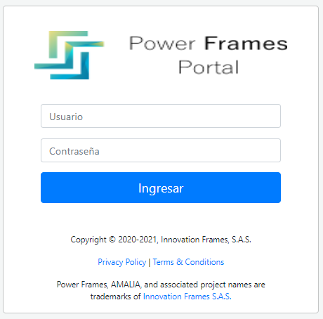
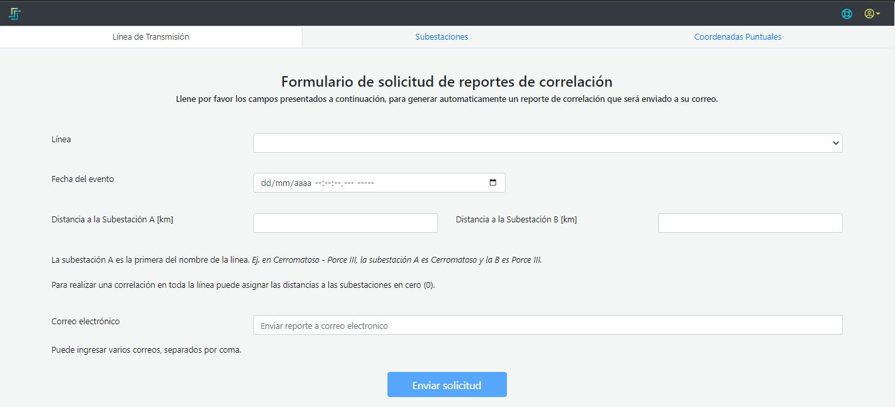
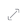

# AMALIA – Plataforma PowerFrames *Manual de usuario*

## Introducción
La plataforma de PowerFrames es una herramienta que tiene como propósito supervisión, pronostico y monitoreo de las descargas atmosféricas y la vulnerabilidad de los activos del pertenecientes al sistema eléctrico nacional.

La plataforma está basada en un sistema llamado AMALIA

## 1. Entrada al aplicativo
Este servicio es una aplicación web que se recomienda ser usada en navegadores basados en … como [Google Chrome.](https://www.google.com/intl/es/chrome/?brand=ALOY&ds_kid=43700059035616983&utm_source=bing&utm_medium=cpc&utm_campaign=1011197%20%7C%20Chrome%20Win10%20%7C%20DR%20%7C%20ESS01%20%7C%20GLOBAL%20%7C%20GLOBAL%20%7C%20es%20%7C%20Desk%20%7C%20SEM%20%7C%20BKWS%20-%20EXA%20%7C%20Txt&utm_term=descargar%20google%20chrome&utm_content=Desk%20%7C%20BING%20SEM%20%7C%20BKWS%20%7C%20Exact%20~%20Download%20Chrome&gclid=20024bb491c21712a0c429376e2f3ccd&gclsrc=3p.ds) Para acceder al aplicativo se debe ingresar a la URL [www.powerframes.co](http://www.powerframes.co/)

Después de estar en el portal principal del aplicativo es necesario acceder, para hacerlo, el usuario debe de hacer uso de sus credenciales de acceso (usuario y contraseña) que han sido suministradas.

• IMPORTANTE: En caso el usuario no tenga credenciales de acceso y la empresa ya se encuentre afiliada a nuestra base de datos, debe de ponerse en contacto con el usuario administrador de dicha empresa para solicitarle las credenciales.

## 2.1. Portal de entrada
Al encontrarse en la página principal del aplicativo siguiendo las indicaciones anteriores podrá ver el portal de entrada a la aplicación, desde donde puede acceder con sus credenciales.

### 2.1.1. Botones disponibles
    

**Nosotros**: acá podrá conocer un poco más de la empresa, en esta opción va a encontrar un poco de información, además de un vídeo de presentación.

**Compañía**: los clientes principales, los proveedores, el respaldo, la experiencia, la visión y la estructura de la empresa puede ser consultada en esta opción.

**Productos**: La descripción de los productos, la infraestructura y la arquitectura que usan cada uno de los productos se muestran en este apartado.

**Contacto**: Los datos donde puede encontrar la solución a las dudas o cualquier información pertinente está desplegado en esta opción.

## 2.1.2 Acceso
    
Una vez seleccionada la opción “Inicie sesión en el portal”, opción bucada en la parte superior derecha como se muestra en la [Figura1](./pictures/Imagen1.png), se redirecciona al apartado de autenticación en el que se deben ingresar Usuario y contraseña para el acceso, tal como se aprecia en la [Figura2](./pictures/Imagen2.png).

**Figura 1.** *Portal de Acceso*

**Figura 2.** *Autenticación de Usuario*

## 2.2. Portal AMALIA  

Ya dentro del aplicativo, AMALIA se encarga de dar la Bienvenida al usuario autenticado y mostrar los diferentes módulos dispuestos para ser usados, Predicciones, Supervisión y Reportes como se muestra en la [Figura3](./pictures/Imagen3.png)

**Figura 3.** *Bienvenida*

### 2.2.1 Módulo de reportes 

En esta opción el usuario puede consultar la correlación que existe entre la salida de una línea de transmisión y una descarga atmosferíca, con el fin de determinar la posibilidad de que la causa de la falla (salida de línea) sea consecuencia de un rayo. 

**Figura 4.** *Solicitud de Reporte*

Para hacer en análisis de esta correlación se requiere contar con los siguientes datos: 

**Línea**: Se debe seleccionar la línea de transmisión sobre la que se esté requiriendo la información de correlación. La plataforma ofrece una lista desplegable con todas las líneas que se encuentran monitoreadas de tal forma que el usuario pueda buscar la de su interés.  

Estas líneas guardan la misma convención de nombre que usa el cliente, 4 letras para el ID de identificación de la subestación A, 4 letras para el ID de identificación de la subestación B, el valor del voltaje de la línea y el número de la línea.  

**Fecha del evento**: Corresponde a la fecha completa en la que se detectó un evento de falla o salida de línea en el activo que se está correlacionando. Este dato tiene resolución microsegundal en un formato de Dia/Mes/Año Hora:Minuto:Segundo.Microsegundo. 

*IMPORTANTE*: Aunque el dato admite valores hasta los microsegundos, solo es obligatorio llenar la información hasta los segundos, es importante tener en cuenta esto, ya que el sistema no hace el cálculo de correlaciones para resoluciones minutales. 

**Distancias a las subestaciones**: Tanto la distancia a la subestación A como a la subestación B son medidas solicitadas en kilómetros y estimadas por los elementos de protección. 

*IMPORTANTE*: Se debe tener en cuenta que la suma de las dos distancias a las subestaciones no debe ser mayor a la longitud de la línea ni menor que ella. 

**Correo electrónico**: esta campo está dispuesto para escribir todo los correos electrónico a los que se quiere que se envíe el informe solicitado, si son varios correos, estos deben ir separados por coma (**,**) entre sí.

Luego de haber ingresado todos los datosy pulsar el botón **Enviar Formulario" la plataforma se encarga de hacer la consulta de la información para generar el reporte, si los datos ingresados están correctos sale una ventana emergente como la [Figura5](./pictures/Imagen5.png) y se realiza el envío del reporte con la información solicitada.

**Figura 5.** *Confirmación de Reporte Enviado*

    >La ventana energente muestra el número del reporte generado que contiene una estrutura de nombre  de la siguientes manera Agente-AñoMesDiaHoraMinuto, estos datos son del momento de la solicitud. 

#### 2.2.1.1. Errores

**Sesion expirada**: La plataforma viene una vigencia de sesión de 45 minutos, razón por la cual despúes de este tiempo, el usuario deberá recargar la página y volver a identificarse, de lo contrario al intentar sacar un reporte, la plataforma no estará habilitada y mostrará una ventana emergente solicitando una nueva autenticación, tal como se ve en la [Figura6](./pictures/Imagen5.png).

**Figura 6.** *Sesion Expirada*

**Error en el reporte**: 
##### *Distancia erronea*: 
Si la suma de las distancias a las subestaciones ingresadas es mayor que el doble de la logitud de la línea, el sistema no va a poder realizar la consulta y se debe repetir el formulario corrigiendo esta información
#### *Tiempo erroneo*: 
Si la estampa de tiempo ingresada es anterior a la fecha en que el activo se empezó a monitorear o, por el contrario, la estampa de tiempo ingresada es menor de 45 minutos de la hora en la que se está haciendo la consulta el sistema no encuentra datos y por lo tanto arroja un error para llenar nuevamente el formulario.

### 2.2.2. Módulo de supervisión 
En este módulo AMALIA se encarga de brindarle al usuario en diferentes visualizaciones la información de recuento de rayos, densidad dinámica de rayos, probabilidades de falla, descargas atmosféricas, análisis de descargas, clusterización de las tormentas, ubicación de las torres, subestaciones y los trazados para rangos de tiempo y espacio definidos por el usuario.
La plataforma está configurado por defecto para que el usuario visualice el mapa de colombia con la información de **"Tiempo Real"**, el mapa se va a mostrar centrad y sin ningún filtro temporal, ni espacial como se muestra en [Figura7](./pictures/Imagen7.png).

**Figura 7.** *Vista inicia módulo de supervisión*

*IMPORTANTE*: El tiempo real está definido como el tiempo relativo correspodiente a 60 minutos, es decir, muestra la información de 60 minutos antes hasta el tiempo presente.

#### 2.2.2.1. Herramientas disponibles
La vista principal del módulo de supervisión cuenta con algunas herramientas dispuestas como botones que le permiten al usuario modificar algunos parametro y hacer uso de ellas para los propósitos específicos. 
En la [Figura 8](./pictures/Imagen8.png) se resaltan los 6 botones herramientas que tiene esta visualización, a continuación se explican cada uno de ellos.

**Figura 8.** *Herramientas de Usuario*

##### *1. Ventana de tiempo*:
Por defecto la plataforma establece la visualización del módulo de supervisión en tiempo real, no obstante, este label le muestra al usuario la ventana de tiempo que tiene seleccionada y sobre la cual se está mostrando toda la información del módulo, de tal forma que cuando se usa algún filtro temporal, este label muestre la ventana consultada.

##### *2. Acercar*:
Esta herramienta le permite al usuario acercar la vizualización, teniendo en cuenta que el acercamiento se va a realizar con base en la el punto medio de la pantalla cada que se haga click sobre él.

##### *3. Alejar*:
Esta herramienta le permite al usuario alejar la vizualización, teniendo en cuenta que el alejamiento se va a realizar con base en la el punto medio de la pantalla cada que se haga click sobre él.

##### *4. Ir a*:
Este botón le permite al usuario ingresar la longitud y latitud, además del zoom como se muestra en la [Figura 9](./pictures/Imagen9.png). de un punto específico y con determinado zoom para que la plataforma centre ese punto en la mitad de la pantalla con el zoom especificado.

**Figura 9.** *Ir a*

*IMPORTANTE*: El valor del zoom debe estar entre 5 y 24, para valores fuera de ese rango la plataforma va a solicitar un nueva valor que cumpla estas condiciones.

##### *5. Ajuste a los datos*:
Con el uso de esta herramienta la plataforma centra el mapa de Colombia con el máximo alejamiento, mostrando todos los datos que se tienen para la ventana de tiempo seleccionada.

##### *6. Herramientas de selección*:
[Figura 10](./pictures/Imagen11.png)

**Figura 9.** *Herramientas de selección*

#### 2.2.2.2. Reanálisis de desarcagas
Esta función de la plataforma se encarga de relacionar todas las descargas atmosféricas que se han detectado y almacenado con los activos que se tienen monitoreados, de tal forma que cada una de la descarga tenga información con base en los diferentes activos y de pueda ver la influencia que cada una de las descargas tiene con los elementos monitoreados, en la [Figura 10](./pictures/Imagen10.png)

Como esta información contiene la información de las descargas respecto a los activos, para esta capa contenga información visible, es necesario tener un acercamiento suficiente para que se vean las descargas discriminadas, los trazados y las torres de cada una de las líneas tal como se ve en la [Figura 10](./pictures/Imagen10.png). 

#####  *1. Distancia*:
Tabla de convención dinámica de acuerdo a las descargas que hay en la ventana de tiempo consultada en todo el territorio. Estos valores varían con respecto a la mayor y menor distacia de las descargas a los activos, de tal forma que los círculos que representan las descargas van a tomar esos colores.

#### *2. Información de la descarga*:
En la capa del reanálisis de las descargas, cada una tiene un número que la representa, este número es la distancia radia en kilómetros al activo más cercano. Cuando se hace click sobre la descarga o se para sobre ella, esta despliega la información de la misma. En esta información se encuentra:

**Fecha:** La estampa de tiempo en la que la descarga se presentó.
**Distancia:** Este valor es el mismo que tiene la descaga y es la distancia en kilómetros al activo (torre) más cercana.
**Torre:** Hace referencia al activo más cercano relacionado con la descarga y muestra el nombre con la nomenclatura de cliente.
**Distancia_a:** es la distancia en kilómetros a la subestación A de la línea de transmisión
**Distancia_b:** es la distancia en kilómetros a la subestación B de la línea de transmisión
**Corriente:** Es la magnitud de la corriente de Kiloamperios de la descarga.
**Polaridad:** Hace raferencia a la polaridad de la descarga. Neg para descargas negativas y POS para descargas positivas.
**Coordenadas:** son los valores de longitud y latitud que determinan la posición estimada de la caída del rayo
**Error:** es el valor en kilómetros del error en la ubicación de la descarga, es decir, la descarga pudo haber caido dentro de una circunferencia con radio del valor del error en kilómetros.

#### 2.2.2.3. Descargas atmosféricas
Esta función de la plataforma se encarga de mostrar todas las descargas atmosféricas que se han detectado y almacenado con la información básica de la descarga, así se puede ver en en la [Figura 14](./pictures/Imagen14.png)

Como esta capa contiene la información de las descargas es necesario llegar a un nivel de zum tal que no se vean los cluster sino las descargas individuales [Figura 14](./pictures/Imagen14.png).

**Figura 14.** *Descargas atmosféricas*

#####  *1. Fecha*:
Tabla de convención dinámica de acuerdo a las descargas que hay en la ventana de tiempo consultada en todo el territorio. Estos valores de estampa de tiempo varían con respecto a la descarga más reciente hasta la antigua, de tal forma que los círculos que representan las descargas van a tomar esos colores.
Además el tamaño del círculo representa la magnitud de la corriente de cada una de las descargas.

#### *2. Información de la descarga*:

*IMPORTANTE:* Las capas pueden no ser visibles por 2 razones
1. El zoom no tenga el ajuste necesario para la capa, ya sea porque esté muy cerca o muy lejos y será necesario modificar el zoom para ver la capa, cuando esto ocurre se ve el siguiente [símbolo](./pictures/Imagen12.png) 
2. Se haya apagado la visualización y en ese caso se verá el [símbolo](./pictures/Imagen11.png) 